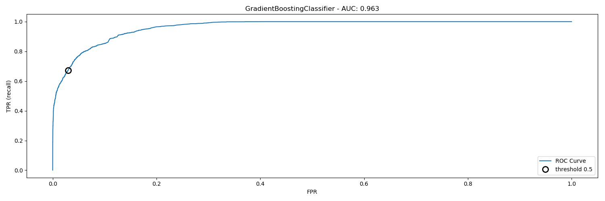
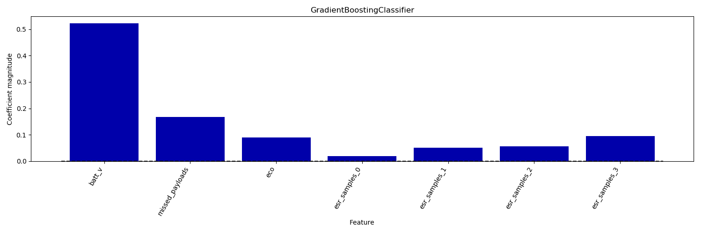

Predicting defective park sensors from key process variables
==========================

This project aims at building an accurate machine learning model to predict whether a park sensor is defective or not and thus is going to die at the next reboot, given all the available features. 

Indeed, rebooting a network will cause some of the parking devices out on the field to not come back to life. 

Each product consists of 7 features ('mac', 'batt_v','missed_payloads', 'eco', 'esr_samples_0', 'esr_samples_1', 'esr_samples_2', 'esr_samples_3'), which are key process variables measurement results collected from the sensor.
 
 
 Measurements are provided in a “.csv” file. 

The code is written in python. There is 1 routine:
* analysis.py: it performs the full modelling. __It is intended to be used e.g. in an IPython session, not as a script__.
 
Here we report the version of the libraries used:
* Python 3.6.4
* numpy 1.14.0
* sklearn 0.19.1
* matplotlib 2.1.2

# Feature engineering and modelling
For the purpose of this task we need to build machine learning model to predict which devices - after rebooting a network - will likely die. While an advantage of ML is that in many cases we can avoid having to create a set of expert-designed rules, that does not mean that prior knowledge of the application should be discarded. That means, we should attempt to identify useful features that are much more informative than the initial representation of the data.  

For the modelling, we consider a Gradient Boosting for classification.

# Dataset Preprocessing
Data are stored as a '.csv' file. We read them via _Pandas_ and store them into an feature matrix X and target vector y (0 for not-defective, 1 for defective).  

Note that we must retrieve which sensors are defective based on the time measurements are taken. We wrote a function in _Pandas_  to determine whether for each device (identified via their mac) the max "distance" in time among all the measurements is larger or nor of 2 days. In other words, if after a day of waiting after a reboot you have not seen data from a device for an extended time it is likely dead permanently.

The dataset is characterized by some missing values, which we dropped via __pandas__. We do not use __imputation__ (the process of replacing missing data with substituted values).  Next, we split the datasets into a training and test datasets via stratified sampling: the measurements are divided into homogeneous subgroups called strata, and the right number of instances is sampled from each stratum to guarantee that the test set is representative of the overall measurements. This is particularly important since our dataset is highly imbalanced, and we do not want to run the risk of introducing a significant sampling bias. 

For all the models we set the hyperparameters (e.g. regularization parameter etc.) via _stratified k-fold cross-validation_. In stratified cross-validation, we split the data such that the proportions between classes are the same in each fold as they are in the whole dataset. 

For the metrics which measure the distance between the model and the data we used the utility function "roc_auc" (that is the area under the receiver operating characteristic curve from prediction scores). This metric is indicated for imbalanced datasets.
 
 We printed also the f1 score (where the scores are averaged computing the mean of the per-class f-scores, weighted by their support). We shall present also "macro" averaging which computes the unweighted per class f-scores; and "micro" averaging which computes the total number of false positives, false negatives, and true positives over all classes, and then computes precision, recall, and f-score using these counts. All scorer objects follow the convention that higher return values are better than lower return values. 

We then print the output of the confusion_matrix, which is a two-by-two array, where the rows correspond to the true classes and the columns correspond to the predicted classes. Each entry
counts how often a sample that belongs to the class corresponding to the row (here,
“defective” and “not-defective”) was classified as the class corresponding to the column.  

We also plot the _receiver operating characteristics curve_, or ROC curve. Indeed, in order to understand a modeling problem better, it is instructive to look at all possible thresholds, or all possible trade-offs of precision and recalls at once. We plot thresholds for a given classifier, and show the false positive rate (FPR, or recall) against the _true positive rate_ (TPR). For the ROC curve, the ideal curve is close to the top left: you want a classifier that produces a _high recall_ while keeping a _low false positive rate_. The optimal picked threshold depends on the business problem under exam. 

# ML Models and Result
We consider a __GradientBoostingClassifier__.  We obtained an f1 score of 0.958. We present the ROC curve below (the big circle corresponds to a threshold of 0.5). 

The __AUC__ is 0.963, so pretty good.

While it is not easy to interpret the coefficients learned by the tree-based models, it is interesting to point out that they provide a _feature_importances_ attribute, which directly encodes the importance of each feature. 

The results from _feature_importances_ are presented in the below fig. 

# Summary
We fitted a __GradientBoostingClassifier__ for the purpose to predict park sensor failures after reboot. We obtained an f1 score of 0.958.
From the _feature_importances_, we can conclude that - beside the batt_v (Battery Voltage) - the most important features are the _missed_payloads_ (the cumulative number of payloads that have failed to materialize), _eco_ (Revision #) and _esr_samples_3_ (the mV of droop on battery voltage as measured 150msec after the removal of a large load from the battery). 

With more time we could have investigated the impact of other features beside the eight accounted for.

